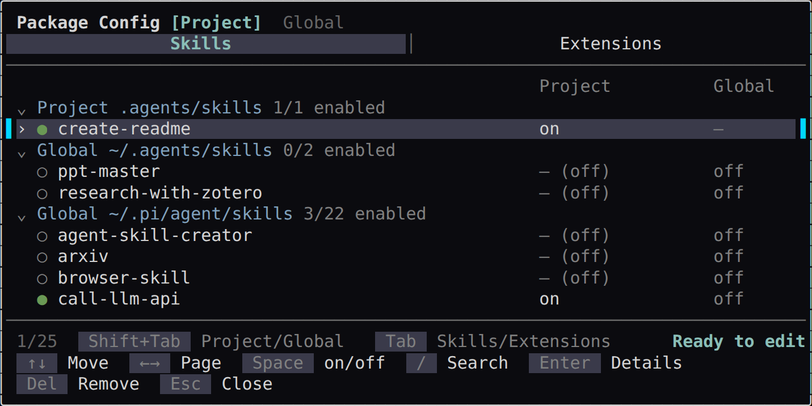

<div align="center">

# pi-pkg-config

*Toggle Pi skills and extensions conveniently inside TUI.*


[Features](#features) · [Install](#install) · [Use](#use) · [Scopes](#scopes)· [Safety](#safety) · [Development](#development)

</div>

`pi-pkg-config` gives a simple TUI for controlling which Pi skills and extensions are active, while keeping everything aligned with Pi's native configuration system.

<div align="center">
  
  <br>
  <sub>Real Pi session with demo skills.</sub>
</div>

## Why you need this extensions?

The extensions originates from one simple frustration:

*Every project needs a different set of extensions and skills.*

Instead of searching, finding, downloading, and configuring them every time, why not install everything globally, disable them by default, and **enable only what you need** for each project?

To do so, frankly speaking, you can **manually** configure `settings.json` to toggle the loading of extensions and skills. However, that's **not convenient** (at least for me. I don't want to remember all the settings syntax or type long paths). The good news is that this extension make managing configuration **much easier**.

## Features

- **Package types**: switch between the Skills and Extensions configuration views with `tab`.

- **Scope control**: toggle between Project and Global scope for Skills and Extensions with `shift+tab`.

- **Toggle resources** — enable or disable each detected Skill and Extension with `space`.

## Install

Install globally from GitHub:

```bash
pi install git:github.com/Lnearfar/pi-pkg-config
```

Install for the current project:

```bash
pi install git:github.com/Lnearfar/pi-pkg-config -l
```

Run `/config` in a Pi TUI session.

## Use

Run `/config`.

The following are keyboard control inside tui (also show at the bottom of the tui)

| Key | Action |
|---|---|
| `Tab` | Switch Skills / Extensions |
| `Shift+Tab` | Switch Project / Global |
| `↑` / `↓` | Navigate resources |
| `←` / `→`, `PageUp` / `PageDown` | Jump one visible screen of resources |
| `Space` | Cycle inherit / on / off (Project) or toggle (Global) |
| `/` | Search resolved resources locally |
| `Enter` | Open resource details |
| `Delete` | Review package removal |
| `Ctrl+S` | Review and save staged changes |
| `Esc` | Clear search, return, discard, or close |

## Scopes

| View | Resources | Columns | Change target |
|---|---|---|---|
| **Project** | Project resources followed by inherited Global resources | `Project` and `Global` | Current project settings and overrides |
| **Global** | Resources resolved from the global Pi environment | `Global` | Global Pi settings |

Inherited rows show `— (on)` or `— (off)`; explicit Project choices show `on` or `off`. Project-only resources show `—` in the Global column. Below 64 columns of inner width, headers shorten to `P` and `G`.

## Safety

This pi extension relies entirely on Pi's **native** package settings mechanisms, with all configurations written explicitly to the corresponding scope's `settings.json`.

## Development

```bash
npm ci
npm run check
npm run pack:check
pi -e .
```

`npm run check` runs TypeScript type-checking and the Node test suite. `npm run pack:check` shows the exact npm tarball contents.

## Documentation

- [`docs/requirements.md`](docs/requirements.md) — confirmed behavior and design decisions
- [`CHANGELOG.md`](CHANGELOG.md) — release history

## If you don't like it
If `pi-pkg-config` does not fit your taste, uninstall it anytime with 
```
pi uninstall git:github.com/Lnearfar/pi-pkg-config
```
All changes remain in the corresponding scope's `settings.json`, where they can be inspected or edited manually.

## Support the Project

If you find `pi-pkg-config` useful, consider leaving a ⭐ — it helps more people discover this project.