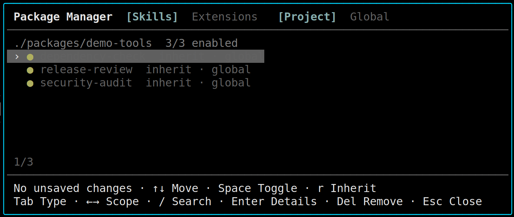
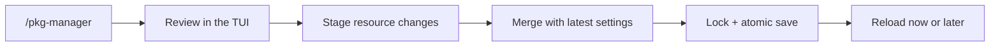

<div align="center">

# pi-pkg-manager

*Manage Pi skills and extensions without leaving Pi.*

[Features](#features) · [Install](#install) · [Use it](#use-it) · [Scopes](#scopes) · [Safety](#safety) · [Development](#development)

</div>

`pi-pkg-manager` is a local-first Pi extension for reviewing and managing the skills and extensions that **Pi already detects**. It provides resource-level enablement, Project overrides, and confirmed package removal in one small TUI.

<div align="center">
  
  <br>
  <sub>Actual run with a local demo package.</sub>
</div>

> [!NOTE]
> This is not a package marketplace. It never searches online, downloads packages, installs packages, or checks for updates.

## Features

- **Manage individual resources** — enable or disable detected Skills and Extensions.
- **Work at the right scope** — edit Global settings or create Project-level `load` / `unload` overrides.
- **Preview before writing** — changes remain staged until `Ctrl+S`; undo them with `Esc`.
- **Inspect what Pi sees** — search locally and open details for the path, source, override state, and diagnostics.
- **Remove packages deliberately** — review the affected resources, then confirm removal from the active scope.
- **Protect your configuration** — merge unrelated external settings changes and write through a lock plus atomic replacement.

The manager itself is marked required and cannot be disabled or removed from its own interface.

## Install

Install globally from GitHub:

```bash
pi install git:github.com/Lnearfar/pi-pkg-manager
```

Or install it only for the current project:

```bash
pi install git:github.com/Lnearfar/pi-pkg-manager -l
```

Start a new Pi session, then open the manager:

```text
/pkg-manager
```

> [!TIP]
> The manager opens in **Skills → Project**. It shows the current Pi configuration as-is; opening it never initializes or rewrites your settings.

## Use it

A typical change takes four steps:

1. Run `/pkg-manager`.
2. Select a Skill or Extension with `↑` / `↓`.
3. Press `Space` to stage the new state. The list immediately shows the preview as `* unsaved`.
4. Press `Ctrl+S`, review the merged change, and decide whether to reload Pi now.

| Key | Action |
|---|---|
| `Tab` | Switch Skills / Extensions |
| `←` / `→` | Switch Project / Global |
| `↑` / `↓` | Navigate resources |
| `Space` | Stage enable/disable |
| `r` | Restore inherit for a Global resource in Project view |
| `/` | Search detected resources locally |
| `Enter` | Open resource details |
| `Delete` | Review package removal |
| `Ctrl+S` | Review and save every staged change |
| `Esc` | Clear search, return, discard, or close |

## Scopes

| View | What you see | What a change affects |
|---|---|---|
| **Global** | Resources resolved from the global Pi environment | Global Pi settings |
| **Project** | Project resources first, then inherited Global resources | The current project's settings and overrides |

Project resources have their own enabled state. Global resources are inherited by default: changing one in Project creates an explicit `load` or `unload` override, while `r` removes that override and restores `inherit`.

> [!IMPORTANT]
> Project settings are read-only until Pi trusts the project. `pi-pkg-manager` never auto-trusts a project or writes `.pi/settings.json` while it is untrusted.

## Remove a package

Press `Delete` on a resource supplied by an installed package. The confirmation shows the package, current scope, and every affected Skill and Extension.

- Only the package configured in the active scope can be removed.
- Package removal is immediate and separate from staged resource toggles.
- Settings are persisted **before** npm/git-managed files are cleaned up.
- A local package source loses its Pi settings entry, but its local files are not deleted.
- Pending resource changes for the removed package are discarded across views.

## Safety

Pi remains the source of truth for resource discovery and resolution. The extension uses Pi's own package and settings APIs rather than maintaining a second scanner.



- Missing package sources are skipped during resolution, so opening or searching does not trigger a download.
- Global and Project changes save independently.
- Unrelated external settings edits are retained in the reviewed candidate.
- Temporary files and locks are cleaned up; no backup, history, or cache files are retained.
- After saving or removing a package, Pi asks whether to reload. If you decline, the change remains saved and Pi reminds you to run `/reload` later.

## Development

```bash
npm install
npm run check
npm pack --dry-run
pi -e ./src/index.ts
```

`npm run check` runs TypeScript type-checking and the Node test suite.

```text
src/                  Extension, backend, model, storage, and TUI
test/                 Unit and integration tests
docs/requirements.md  Confirmed v1 behavior and design decisions
CONTEXT.md            Project terminology
```

## Compatibility

- Validated with Pi `0.85.1`.
- v1 manages **Skills** and **Extensions**; prompts and themes are outside this interface.
- Search is local filtering of Pi-detected resources, not an online package search.
- Pi `0.85.1` does not safely expose current extension runtime diagnostics. Extension diagnostics are limited to safe path checks; skill validation and collision diagnostics use Pi's public skill loader.
- Project overrides for global local resources can contain absolute paths, so moving a resource can invalidate its override.
- `/pkg-manager` requires Pi's TUI mode.

## Documentation

- [`docs/requirements.md`](docs/requirements.md) — confirmed v1 requirements and behavior
- [`CONTEXT.md`](CONTEXT.md) — project terminology
